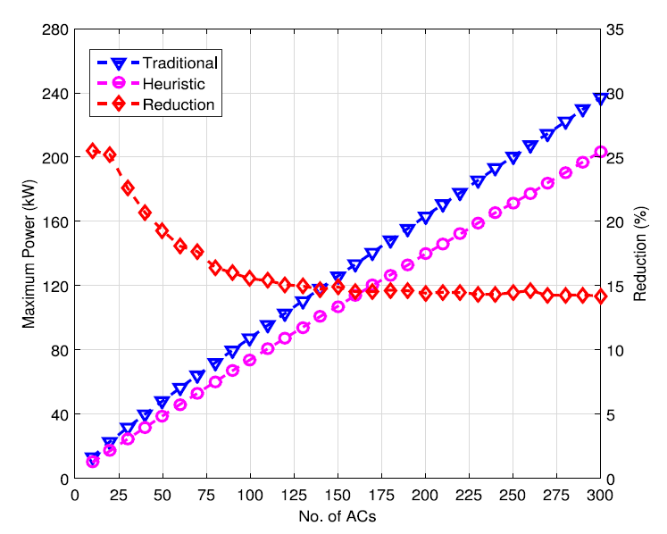

# Peak load minimization in smart grid by optimal coordinated ON–OFF scheduling of air conditioning compressors
Official repository for AC Peak Load Minimization, Elsevier Sustainable Energy, Grids and Networks 2021

## [Paper][paper]
[paper]: http://naimulhassan.github.io/content/papers/peak-load-min.pdf

          
          
</td>

Abstract: <i>We address the problem of minimizing the peak load by optimal coordinated ON–OFF scheduling of the compressors of air conditioners (ACs) connected in a smart grid. For this purpose, we consider a simplified model of power consumption profile, i.e., on-time and off-time durations and power consumption values of a split type AC. We model the necessary constraints and formulate an optimization problem to minimize the peak load by optimal coordinated ON–OFF scheduling of the AC compressors. The optimization problem is found to be a complex mixed integer linear programming problem. We optimally solve the problem for a small number of ACs by using an optimization tool. Unfortunately, due to the computational complexity, the tool cannot solve the problem for a large number of ACs. For a large number of ACs, we develop a heuristic algorithm to solve the problem. Using the optimization tool and the heuristic algorithm, we determine the peak load, load variance, and energy consumption in operating a number of ACs and compare them with the results obtained for a traditional non-coordinated AC operation. We find that both the optimal and heuristic solution approaches significantly reduce the peak load and load variance with some increment of energy consumption. Further, the computation time of the scheduling of the AC compressors of an air conditioning system under the heuristic algorithm is found to be significantly less compared to the time bound on scheduling computation of the AC compressors even when the number of ACs in the system is large.</i>

## Citation
@article{UDDIN2021100545, 
title = {Peak load minimization in smart grid by optimal coordinated ON–OFF scheduling of air conditioning compressors}, 
journal = {Sustainable Energy, Grids and Networks}, 
volume = {28}, 
pages = {100545}, 
year = {2021}, 
issn = {2352-4677}, 
doi = {https://doi.org/10.1016/j.segan.2021.100545}, 
url = {https://www.sciencedirect.com/science/article/pii/S2352467721001168}, 
author = {Md. Forkan Uddin and K M Naimul Hassan and Soumav Biswas}, 
keywords = {Air conditioning system, Dead-band temperature, Smart grid, Load scheduling, Optimization, Mixed integer linear programming, Heuristic algorithm, Power consumption} 
}